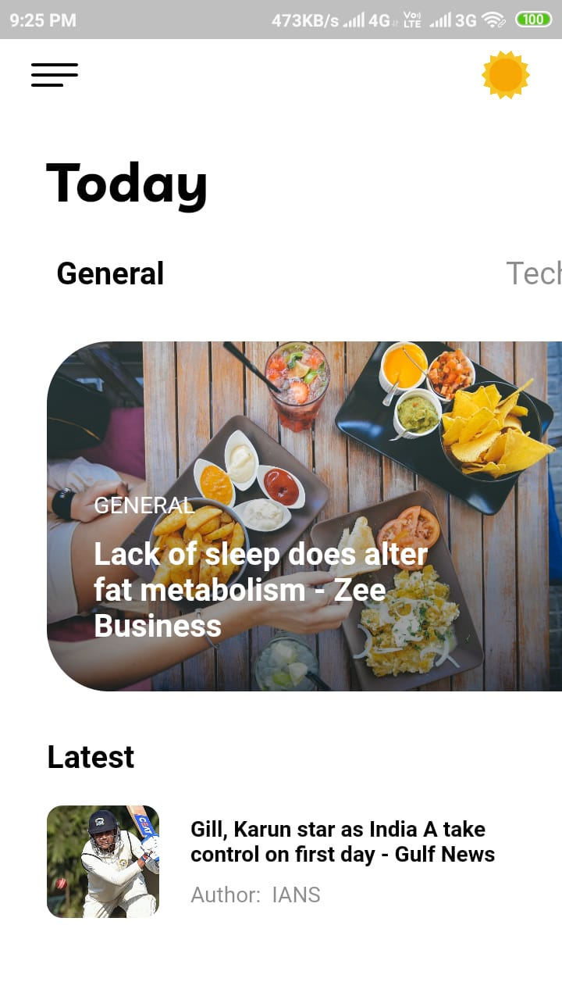
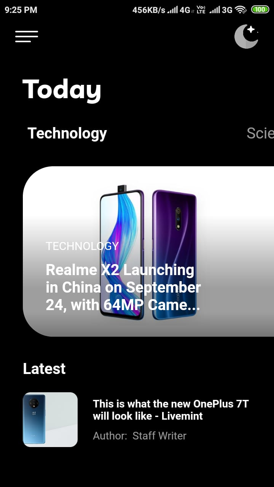

# News App

Major UI Revamp of my previous news app.

## ScreenShots

## Download APK
APK Link: https://drive.google.com/file/d/1fPBdiZX5Nc6ZxmCl7X7Y9NK06EAz0KWm/view?usp=sharing

## Steps after Cloning the repo

1) Go to https://newsapi.org
2) Create an account and get an API KEY
3) Paste the API KEY in lib/scoped_models/ConnectedModel.dart line 43
4) Done!! :)
