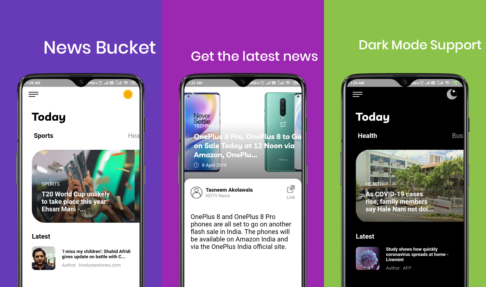

# News Bucket 


News Bucket is a major UI Revamp of my previous news app. It uses newsapi.org for its data.



## Download

[](https://play.google.com/store/apps/details?id=news.bucket)


## Installation

1. Clone the repo
2. Go to ```https://newsapi.org```
3. Create an account and get an API KEY
4. Paste the API KEY in ```lib/scoped_models/ConnectedModel.dart``` line 43
5. Run the app

## Meta

Ibtesam Ansari – [LinkedIn](https://www.linkedin.com/in/ibtesamansari/) – ibtesamansari070@gmail.com

[https://github.com/ibtesam123](https://github.com/ibtesam123)

## Contributing

1. Fork it (<https://github.com/ibtesam123/NewsBucket/fork>)
2. Create your feature branch (`git checkout -b feature/fooBar`)
3. Commit your changes (`git commit -m 'Add some fooBar'`)
4. Push to the branch (`git push origin feature/fooBar`)
5. Create a new Pull Request
